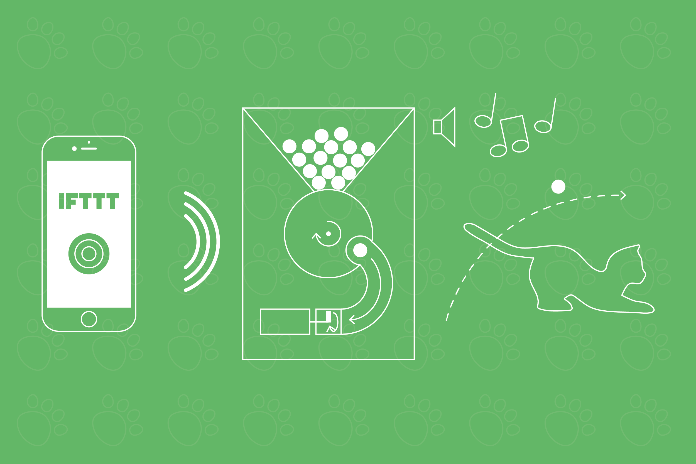
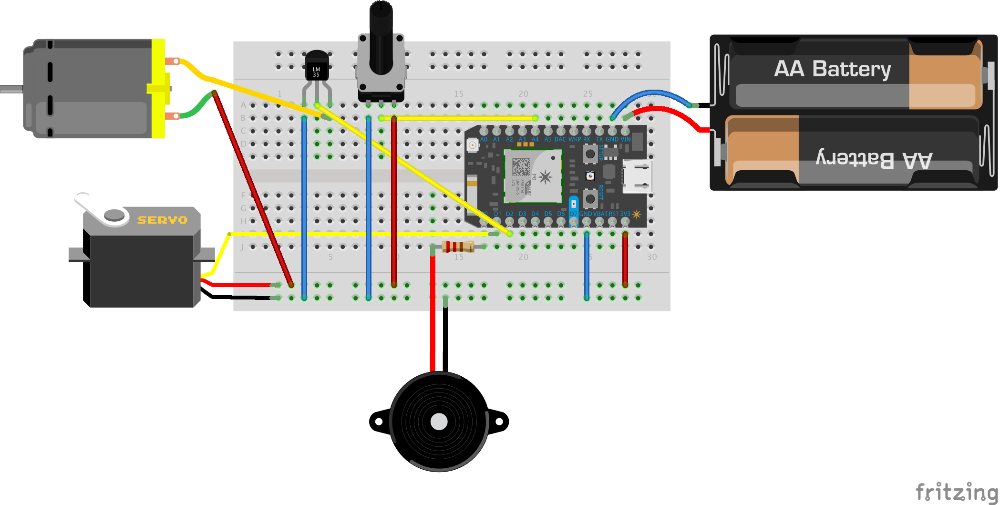
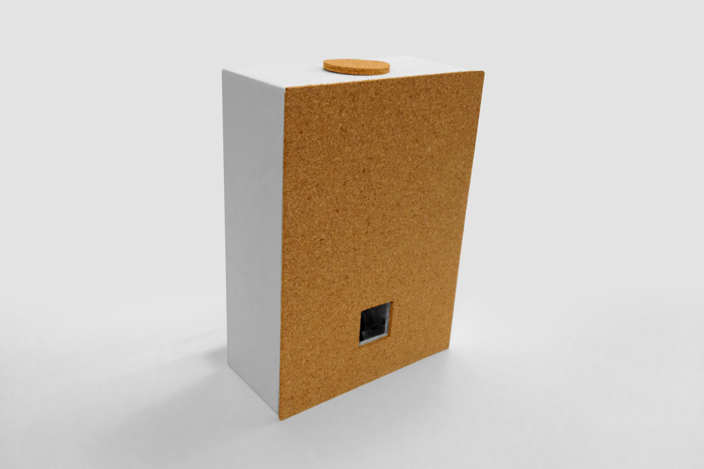
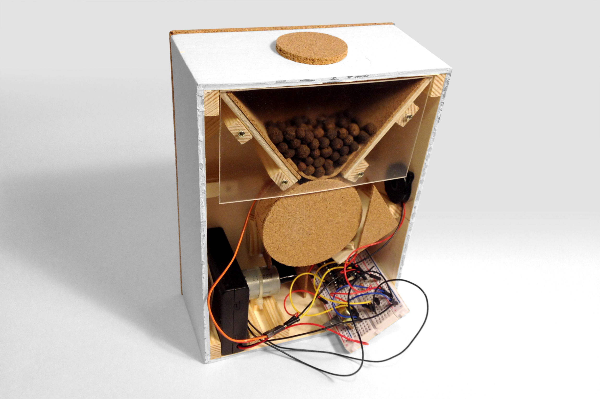

# TreatSpin

The project was created during the project weeks 2015 in the Course Johnny-Five-Is-Alive at the University of Applied Sciences Potsdam, led by Fabian Morón Zirfas. The goal of the 2-week course was to implement an IOT project (Internet of Things) of your choice. There I got an insight into the framework of Johnny-Five, Node.js and Git. However, for the final implementation of the project, we could choose another technology.

## The Project
During the semester break I already had the idea for such a project on my mind, but I could not find the time to actually implement it. So I took the chance to combine this with the course.

Since my cats are quite lazy, I had the vision to build a gadget that would make them move more: The idea of a treat spin was born. Simultaneously, I wanted to be able to lean back and use it as easy as possible – from the sofa or while being out and about.

### How it works

1. A Button on the smartphone triggers the Gadget
2. A Piezo makes a sound, so that the treat spin attracts the cats’ attention and they know that something is about to happen
3. A servo motor rotates and takes a treat
4. A DC motor spins it away
5. A potentiometer allows to control the speed and thus the distance

I am using the following hardware:

*	Particle Photon
*	Piezo KP-Serie
*	Motraxx DC-Motor 3V/DC
*	Sparkfun Servo (Micro Size)
*	Potentiometer
*	Various cables
*	Bipolar Transistor
*	Battery Box

The circuit diagram for this looks as follows:

Unfortunately there were complications with the implementation of the case and the inner mechanics, which can be seen in the video. The problem is that the mechanism is too vague, which leads to complications in transporting just a single treat. Therefore, it frequently takes along more treats at once.This however can be explained with the used materials, the accuracy of implementation and the limited time to realize the project.

## IFTTT

In order to be able to concentrate on the hardware, I used the free service IFTTT, thus I did not have to program an app for the trigger by myself. The IFTTT allows a user to connect different services with each other. Plus, it is possible to use a DO-Button to trigger a defined function on the Particle Photon. Therefore, it is the ideal and most simple solution for my project.

### Instructions

1. Load the code on your Particle Photon

2. Create an Account on IFTTT

3. Search for Particle Channel and connect to it

4. Create a new DO-Particle Recipes

5. IFTTT should automatically display the function name in the list:
> spin on "Your Photon“

6. Then the function input must be specified:
> on

---

### [Visit Vimeo to see the final video!](https://vimeo.com/143996767)

---

This project was created at the University of Applied Sciences Potsdam  
Course: Johnny-Five-Is-Alive  
Semester: 2015

## License

The MIT License (MIT)

Copyright (c) 2015 Christopher Klement

Permission is hereby granted, free of charge, to any person obtaining a copy
of this software and associated documentation files (the "Software"), to deal
in the Software without restriction, including without limitation the rights
to use, copy, modify, merge, publish, distribute, sublicense, and/or sell
copies of the Software, and to permit persons to whom the Software is
furnished to do so, subject to the following conditions:

The above copyright notice and this permission notice shall be included in all copies or substantial portions of the Software.

THE SOFTWARE IS PROVIDED "AS IS", WITHOUT WARRANTY OF ANY KIND, EXPRESS OR
IMPLIED, INCLUDING BUT NOT LIMITED TO THE WARRANTIES OF MERCHANTABILITY,
FITNESS FOR A PARTICULAR PURPOSE AND NONINFRINGEMENT. IN NO EVENT SHALL THE
AUTHORS OR COPYRIGHT HOLDERS BE LIABLE FOR ANY CLAIM, DAMAGES OR OTHER
LIABILITY, WHETHER IN AN ACTION OF CONTRACT, TORT OR OTHERWISE, ARISING FROM,
OUT OF OR IN CONNECTION WITH THE SOFTWARE OR THE USE OR OTHER DEALINGS IN THE
SOFTWARE.
